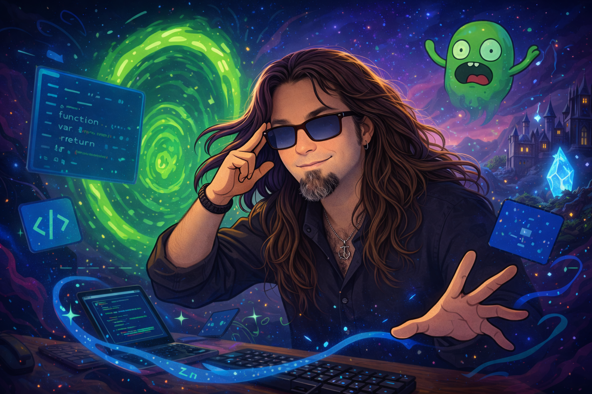

<h1 align="center">Hi! I´m Kilian</h1>

📝 Student 📝  🌍 Explorer 🌍  🔍 Always learning something new 🔍

 

  

 

 

  

---

 

<h3 align="center">💻 About Me 💻</h3>

 

<h4 align="center">
I’m a curious learner who enjoys building small projects and experimenting with ideas.  
Right now, I’m exploring a bit of AI and learning how to become better developer in the world around videogames.

I like mixing logic with creativity & magic, and I believe every bug has a story to tell. Mistakes help us grow 😄
</h4>

  

---

 

<h2 align="center">🎧 My Music Playlist While Working On! 🎧</h2>

 

  

  

---

 

<h3 align="center">⚙️ What Do I Use? ⚙️</h3>

 

<h4 align="center">
🧩 REACT and ANGULAR are the frameworks I am more comfortable with, but I may work with everything I get in my hands! Learning something new is always a pleasure.  

🖥️ VS Code • GitHub
</h4>

  

---

 

<h3 align="center">✏ A Thought ✏</h3> 

 

<h4 align="center">
"Calm in mind, relentless in challenge. I like to code between mystery and fantasy, turning the unknown into reality."
</h4>

  

---

 

<h2 align="center">Find Me On</h2>

 

  
  &nbsp;&nbsp;&nbsp;
  

  
